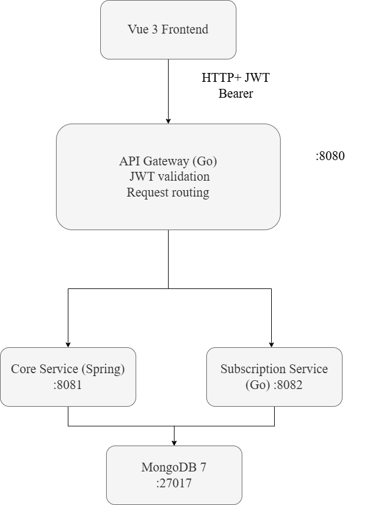

# Sova Lang

**Sova Lang** — это платформа для изучения английского языка, которая обучает практическому английскому через симуляцию реальных жизненных ситуаций. Пользователи проходят интерактивные сценарии на основе диалогов — заказ в ресторане, заселение в отель, визит к врачу — чтобы развивать словарный запас и уверенность в общении в контексте.

---

## Архитектура

Платформа построена как микросервисная система с использованием паттерна API Gateway:




*Рисунок 1 — Архитектура платформы Sova Lang*

### Обзор сервисов

| Сервис | Технология | Назначение |
|--------|-----------|------------|
| Frontend | Vue 3 + Vite | SPA — проигрыватель сценариев, профиль, таблица лидеров |
| API Gateway | Go | Валидация JWT, обратный прокси, маршрутизация запросов |
| Core Service | Spring Boot 4 (Java 21) | Аутентификация, сценарии, управление пользователями, система опыта |
| Subscription Service | Go | Управление премиум-подписками и логика биллинга |
| Database | MongoDB 7 | Единое документоориентированное хранилище данных |

---

## Возможности

- **Интерактивные сценарии** — 6 диалогов из реальной жизни (аэропорт, кофейня, врач, отель, аптека, ресторан) с ветвлением сюжета и заданиями с выбором ответа
- **Геймификация** — система опыта (50 XP за завершённый сценарий), отслеживание серий ежедневных занятий, глобальная таблица лидеров
- **Бесплатный и премиум-доступ** — базовые сценарии доступны бесплатно; расширенный контент требует активной подписки
- **Аутентификация через JWT** — stateless-поток access/refresh токенов с безопасным хранением в httpOnly cookie
- **Профили пользователей** — личная статистика (общий XP, текущая серия, завершённые сценарии), управление именем и паролем
- **Отслеживание прогресса** — автоматическое сохранение и возобновление, детальная аналитика по каждому сценарию

---

## Требования

- [Docker](https://www.docker.com/) и Docker Compose v2.0+
- Node.js >= 20.19.0 (только для разработки фронтенда)
- Go 1.21+ (только для разработки API Gateway и subscription-service)
- Java 21 LTS и Maven 3.9+ (только для разработки core-service)

---

## Быстрый старт

Самый быстрый способ запустить полный стек локально:

```bash
docker-compose up --build
```

После успешного запуска сервисы будут доступны по адресам:

| Сервис | URL | Описание |
|--------|-----|----------|
| Frontend | http://localhost:5173 | Основной пользовательский интерфейс |
| API Gateway | http://localhost:8080 | Единая точка входа в API |
| Core Service | http://localhost:8081 | Бизнес-логика и доступ к данным |
| Subscription Service | http://localhost:8082 | Управление подписками |
| MongoDB | localhost:27017 | База данных (для прямого доступа при необходимости) |

---

## Конфигурация Docker Compose

Файл `docker-compose.yml` описывает следующие сервисы:

### mongo
- Образ: `mongo:7`
- Порт: `27017` (открыт для разработки)
- Том: `mongo_data` для постоянного хранения данных
- Healthcheck: команда ping MongoDB с интервалом 10 секунд

### core-service
- Контекст сборки: `./core-service`
- Порт: `8081`
- Переменные окружения:
  - `SPRING_DATA_MONGODB_URI`: строка подключения к MongoDB
  - `SUBSCRIPTION_SERVICE_URL`: внутренний URL сервиса подписок
  - `JWT_SECRET`: общий секрет для подписи токенов
- Зависимость: ожидает успешного прохождения healthcheck сервиса `mongo`

### subscription-service
- Контекст сборки: `./subscription-service`
- Порт: `8082`
- Переменные окружения:
  - `MONGO_URI`: строка подключения к MongoDB
  - `JWT_SECRET`: общий секрет для валидации токенов
- Зависимость: ожидает успешного прохождения healthcheck сервиса `mongo`

### api-gateway
- Контекст сборки: `./api-gateway`
- Порт: `8080` (основная точка входа)
- Переменные окружения:
  - `CORE_SERVICE_URL`: внутренний URL core-сервиса
  - `SUBSCRIPTION_SERVICE_URL`: внутренний URL сервиса подписок
  - `JWT_SECRET`: общий секрет для валидации токенов
- Зависимости: ожидает запуска обоих бэкенд-сервисов

---

## Локальная разработка

### Frontend (Vue 3)

```bash
cd frontend
npm install
npm run dev
```

Сервер разработки Vite запускается на `http://localhost:5173` и проксирует запросы к API через шлюз на `http://localhost:8080`.

### Core Service (Spring Boot)

```bash
cd core-service
./mvnw spring-boot:run
```

Убедитесь, что MongoDB запущена и переменная `SPRING_DATA_MONGODB_URI` настроена корректно.

### API Gateway (Go)

```bash
cd api-gateway
go mod tidy
go run .
```

### Subscription Service (Go)

```bash
cd subscription-service
go mod tidy
go run .
```

---

## Переменные окружения

### Core Service

| Переменная | Значение по умолчанию | Описание |
|------------|----------------------|----------|
| `PORT` | `8081` | Порт HTTP-сервера |
| `SPRING_DATA_MONGODB_URI` | `mongodb://mongo:27017/core_service` | Строка подключения к MongoDB |
| `SUBSCRIPTION_SERVICE_URL` | `http://subscription-service:8082` | Внутренний URL для сервис-дискавери |
| `JWT_SECRET` | *(обязательно)* | Секрет HMAC для подписи JWT (минимум 32 символа) |

### API Gateway

| Переменная | Значение по умолчанию | Описание |
|------------|----------------------|----------|
| `PORT` | `8080` | Порт HTTP-сервера |
| `CORE_SERVICE_URL` | `http://core-service:8081` | URL upstream core-сервиса |
| `SUBSCRIPTION_SERVICE_URL` | `http://subscription-service:8082` | URL upstream сервиса подписок |
| `JWT_SECRET` | *(обязательно)* | Должен совпадать с секретом core-service для валидации токенов |

### Subscription Service

| Переменная | Значение по умолчанию | Описание |
|------------|----------------------|----------|
| `PORT` | `8082` | Порт HTTP-сервера |
| `MONGO_URI` | `mongodb://localhost:27017` | Строка подключения к MongoDB |
| `JWT_SECRET` | *(обязательно)* | Должен совпадать с секретом core-service для валидации токенов |

> **Важно**: в продакшене никогда не коммитьте `JWT_SECRET` в репозиторий. Используйте инъекцию переменных окружения или менеджеры секретов.

---

## Справочник API

Полная спецификация OpenAPI 3.0 доступна в файле [`api.yaml`](./api.yaml). Её можно просмотреть интерактивно через Swagger UI или Redoc.

### Эндпоинты аутентификации

| Метод | Путь | Описание | Тело запроса | Ответ |
|-------|------|----------|--------------|-------|
| POST | `/auth/register` | Регистрация нового пользователя | `{name, email, password}` | `{tokens, user}` |
| POST | `/auth/login` | Аутентификация пользователя | `{email, password}` | `{tokens, user}` |
| POST | `/auth/refresh` | Обновление access-токена | `{refreshToken}` | `{accessToken, refreshToken, expiresIn}` |

### Эндпоинты сценариев

| Метод | Путь | Описание | Параметры запроса | Ответ |
|-------|------|----------|-------------------|-------|
| GET | `/scenarios` | Список доступных сценариев | `page`, `pageSize`, `free`, `tags` | `{items, meta}` |
| GET | `/scenarios/{id}` | Детали сценария | — | Объект `Scenario` |
| GET | `/scenarios/{id}/progress` | Прогресс пользователя по сценарию | — | Объект `ScenarioProgress` |
| POST | `/scenarios/{id}/parts/{partId}/answer` | Отправка ответа на проверку | `{userAnswer}` | `{isCorrect, xpEarned, nextPartId}` |

### Эндпоинты пользователя

| Метод | Путь | Описание | Тело запроса | Ответ |
|-------|------|----------|--------------|-------|
| GET | `/users/me` | Профиль текущего пользователя | — | Объект `User` |
| PATCH | `/users/me/name` | Обновление отображаемого имени | `{name}` | Объект `User` |
| PATCH | `/users/me/password` | Смена пароля | `{currentPassword, newPassword}` | `204 No Content` |
| GET | `/users/me/stats` | Статистика пользователя | — | `{totalXp, streak, level, ...}` |
| DELETE | `/users/me` | Удаление аккаунта | — | `204 No Content` |

### Эндпоинты подписок

| Метод | Путь | Описание | Тело запроса | Ответ |
|-------|------|----------|--------------|-------|
| POST | `/subscriptions` | Оформление новой подписки | `{durationInDays}` | Объект `Subscription` |
| GET | `/subscriptions/current` | Получение активной подписки | — | Объект `Subscription` |
| DELETE | `/subscriptions/current` | Отмена активной подписки | — | Объект `Subscription` |

### Таблица лидеров

| Метод | Путь | Описание | Параметры запроса | Ответ |
|-------|------|----------|-------------------|-------|
| GET | `/leaderboard` | Топ пользователей по опыту | `page`, `pageSize` | `{items, meta}` |

---

## Структура проекта

```
sova_lang/
├── api-gateway/              # Go reverse proxy + JWT validation
├── core-service/             # Spring Boot — auth, scenarios, users, XP
│   └── src/main/resources/
│       └── scenarios/        # JSON scenario definitions
├── subscription-service/     # Go — subscription management
├── frontend/                 # Vue 3 SPA
│   └── src/
│       ├── pages/            # HomePage, ScenariosPage, ScenarioPage, ProfilePage
│       ├── api/              # Axios client + interceptors
│       ├── router/           # Vue Router
│       └── stores/           # Pinia (user, session)
├── docker-compose.yml
├── api.yaml                  # OpenAPI 3.0 spec
└── load_test.js              # k6 load testing script
```


---

## Тестирование

### Юнит-тесты

**Core Service (Spring Boot):**
```bash
cd core-service
./mvnw test
```
Включает тесты для `AuthService`, `ScenarioService`, `LeaderboardService` — всего 24 теста.

**Subscription Service (Go):**
```bash
cd subscription-service
go test ./...
```

**API Gateway (Go):**
```bash
cd api-gateway
go test ./...
```

### Интеграционные тесты

Запустите полный стек и выполняйте тесты против `http://localhost:8080`:
```bash
docker-compose up --build -d
# Запустите вашу интеграционную тестовую систему
```

### Нагрузочное тестирование

Требуется [k6](https://k6.io/):

```bash
k6 run load_test.js
```

Скрипт выполняет три этапа тестирования:
1. **Smoke**: 10 виртуальных пользователей в течение 30 секунд — проверка базовой связности
2. **Load**: Плавное увеличение до 50 пользователей за 2 минуты, удержание 5 минут
3. **Stress**: Увеличение до 100 пользователей, затем снижение — определение точки отказа

---

## Определения сценариев

Сценарии — это JSON-файлы, загружаемые при старте приложения из директории `core-service/src/main/resources/scenarios/`.

### Доступные сценарии

| ID сценария | Название | Уровень доступа | Примерное время |
|-------------|----------|----------------|-----------------|
| `airport_checkin` | Регистрация в аэропорту | Бесплатно | 8–10 мин |
| `coffee_shop` | Заказ в кофейне | Бесплатно | 6–8 мин |
| `doctor_appointment` | Визит к врачу | Премиум | 10–12 мин |
| `hotel_checkin` | Заселение в отель | Премиум | 9–11 мин |
| `pharmacy` | Покупка в аптеке | Премиум | 7–9 мин |
| `restaurant` | Посещение ресторана | Премиум | 10–13 мин |

### Структура JSON сценария

```json
{
  "id": "coffee_shop",
  "name": "Заказ в кофейне",
  "level": "A1",
  "free": true,
  "description": "Практика заказа еды и напитков в неформальной обстановке",
  "tags": ["food", "travel", "present_simple", "polite_requests"],
  "parts": [
    {
      "id": "part_1",
      "name": "Приветствие",
      "type": "SINGLE_CHOICE",
      "content": {
        "question": "Как начать разговор?",
        "options": [
          {"id": "opt_1", "text": "Дайте кофе"},
          {"id": "opt_2", "text": "Здравствуйте, можно мне кофе, пожалуйста?"}
        ],
        "correctOptionId": "opt_2"
      }
    }
  ]
}
```

---

## Устранение неполадок

### Проблемы с подключением к MongoDB
- Убедитесь, что порт 27017 не занят другим экземпляром MongoDB
- Проверьте статус healthcheck: `docker-compose ps`
- Убедитесь в корректности формата строки подключения: `mongodb://mongo:27017/dbname`

### Ошибки аутентификации JWT
- Подтвердите, что `JWT_SECRET` идентичен во всех сервисах
- Убедитесь, что секрет содержит не менее 32 символов
- Проверьте время жизни токена: access-токены истекают через 15 минут по умолчанию

### Ошибки проксирования фронтенда
- Убедитесь, что target прокси Vite совпадает с URL шлюза (`http://localhost:8080`)
- Проверьте консоль браузера на наличие ошибок CORS или сетевых проблем
- Убедитесь, что шлюз запущен и отвечает на healthcheck-запросы

### Порядок запуска сервисов
- Сервисы зависят от healthcheck MongoDB — подождите ~15 секунд после `docker-compose up`
- API Gateway зависит от бэкенд-сервисов — дайте дополнительное время для полной инициализации

---

## Внесение вклада

1. Форкните репозиторий
2. Создайте ветку для функциональности: `git checkout -b feature/your-feature`
3. Зафиксируйте изменения: `git commit -m 'Add: ваша функциональность'`
4. Отправьте в ветку: `git push origin feature/your-feature`
5. Откройте Pull Request с описанием изменений

### Стиль кода
- **Java**: Следуйте конвенциям Spring Boot, используйте `google-java-format`
- **Go**: Запускайте `gofmt` и `golint` перед коммитом
- **Vue/JS**: Используйте конфигурацию ESLint + Prettier из `frontend/.eslintrc.js`
- **API**: Обновляйте `api.yaml` при любых изменениях эндпоинтов

---

## Лицензия

Данный проект разработан в образовательных целях.